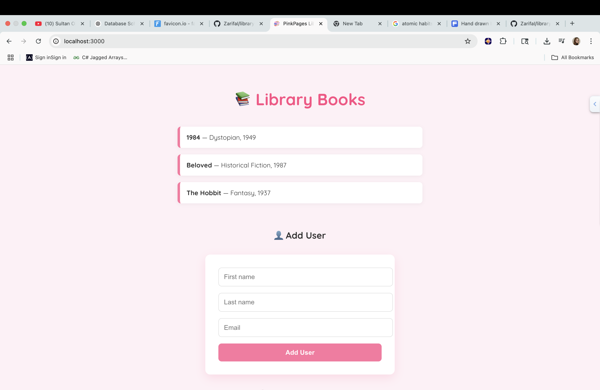

# 📚 PinkPages Library — Frontend


Welcome to **PinkPages Library**, a stylish full-stack library management app built with a pink aesthetic, React frontend, and C# + PostgreSQL backend.

This frontend connects to a real backend API to let users:
- 📖 View a list of books
- 👤 Add new users
- 📘 Add new books
- 💅 Enjoy a cozy, pink-themed design

---

## 🌐 Live Preview (coming soon)

> You can run this locally by following the steps below 👇

---

## 🧰 Tech Stack

- ⚛️ React (Create React App)
- 🎨 Custom CSS (pink aesthetic)
- 🔄 Fetch API (connects to C# backend)
- 🧠 JSON data from ASP.NET Core API

---

## 📸 Screenshots



> Want to add your own screenshot? Take one and save it as `screenshot.png` in the root folder.

---

## 🚀 How to Run Locally

### 1. Clone the repo

```bash
git clone https://github.com/YOUR_USERNAME/library-client.git
cd library-client
